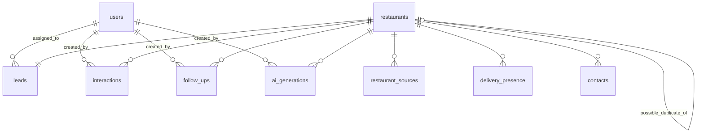

# Base de datos — Restaurant Leads

PostgreSQL 16. Acceso mediante SQLAlchemy 2 (async) y migraciones con Alembic.

## Convenciones

- PK: `id UUID` con `gen_random_uuid()`.
- Timestamps: `timestamptz` (UTC).
- Nombres: `snake_case`; tablas en plural.
- Estados/canales/plataformas: **enums nativos de PostgreSQL** (impiden valores inválidos en BD).
- Borrado: **soft delete** (`deleted_at`) en la UI; DELETE físico solo para supresión RGPD.
- Todo dato externo registra **su fuente** y, si aplica, su fecha de verificación.
- Las interacciones **nunca se borran** (salvo supresión RGPD del restaurante).

---

## Diagrama de relaciones



---

## Enums

| Enum | Valores |
|---|---|
| `user_role` | `admin`, `sales` |
| `lead_status` | `new`, `qualified`, `contacted`, `no_response`, `follow_up`, `interested`, `meeting`, `customer`, `not_interested`, `wrong_number`, `out_of_area`, `duplicate` |
| `lead_priority` | `low`, `medium`, `high` |
| `source_type` | `manual_import`, `osm`, `google_places`, `manual` |
| `delivery_platform` | `glovo`, `uber_eats`, `just_eat`, `deliveroo`, `own_delivery`, `other` |
| `detection_method` | `website_link`, `manual`, `api` |
| `contact_type` | `phone`, `email`, `whatsapp`, `website`, `address` |
| `interaction_channel` | `call`, `whatsapp`, `email`, `meeting`, `other` |
| `interaction_result` | `no_answer`, `busy`, `callback_requested`, `interested`, `not_interested`, `meeting_scheduled`, `wrong_number`, `out_of_area`, `duplicate_reported` |
| `follow_up_status` | `pending`, `completed`, `postponed`, `cancelled` |
| `generation_type` | `briefing`, `call_script`, `commercial_message`, `follow_up_message` |

---

## Entidades

### users

Usuarios internos. `admin` gestiona usuarios e ingesta; `sales` opera el CRM.

| Columna | Tipo | Restricciones |
|---|---|---|
| `id` | UUID | PK |
| `email` | TEXT | NOT NULL, UNIQUE (guardado en minúsculas) |
| `full_name` | TEXT | NOT NULL |
| `hashed_password` | TEXT | NOT NULL (bcrypt) |
| `role` | `user_role` | NOT NULL, default `sales` |
| `is_active` | BOOLEAN | NOT NULL, default `true` |
| `created_at`, `updated_at` | timestamptz | NOT NULL, default `now()` |

### restaurants

El corazón del sistema. Cada dato de contacto guarda **su fuente y última verificación**
(enriquecimiento sin sobrescrituras silenciosas).

| Columna | Tipo | Restricciones |
|---|---|---|
| `id` | UUID | PK |
| `name` | TEXT | NOT NULL |
| `normalized_name` | TEXT | NOT NULL (índice) — para matching |
| `phone` | TEXT | E.164 (`+34612345678`), índice |
| `phone_source` | `source_type` | nullable |
| `phone_verified_at` | timestamptz | nullable |
| `email` | TEXT | nullable |
| `email_source` / `email_verified_at` | — | igual patrón que phone |
| `website` | TEXT | nullable (dominio raíz normalizado) |
| `website_source` / `website_verified_at` | — | igual patrón |
| `address` | TEXT | nullable |
| `city` | TEXT | nullable, índice |
| `postal_code` | TEXT | nullable |
| `latitude` / `longitude` | NUMERIC(9,6) | nullable |
| `category` | TEXT | nullable (ej. `kebab`, `pizzería`) |
| `possible_duplicate_of_id` | UUID | FK → `restaurants.id`, nullable |
| `deleted_at` | timestamptz | nullable (soft delete) |
| `created_at`, `updated_at` | timestamptz | NOT NULL |

**Índices**: `(normalized_name)`, `(phone)`, `(city)`, `(city, category)`, `(possible_duplicate_of_id)`.

### restaurant_sources

Procedencia de cada restaurante (trazabilidad RGPD). Una fila por par fuente/restaurante;
si un mismo restaurante aparece en dos fuentes, se añaden filas (no se duplica el restaurante).

| Columna | Tipo | Restricciones |
|---|---|---|
| `id` | UUID | PK |
| `restaurant_id` | UUID | FK → restaurants, NOT NULL, ON DELETE CASCADE |
| `source` | `source_type` | NOT NULL |
| `source_url` | TEXT | nullable |
| `external_id` | TEXT | nullable (id en la fuente: node OSM, place id...) |
| `first_seen_at`, `last_seen_at` | timestamptz | NOT NULL |

**Constraint**: `UNIQUE NULLS NOT DISTINCT (restaurant_id, source, external_id)` — un mismo
par fuente/id no se registra dos veces, pero se permite `external_id` nulo (alta manual).
**Índice**: `(source, external_id)` — matching por id externo.

### delivery_presence

Presencia del restaurante en cada plataforma. **Nunca se deduce con scraping de plataformas**
(sus ToS lo prohíben): se detecta en la web del propio restaurante (`website_link`) o la
confirma el comercial (`manual`). El método queda registrado en `detection_method`.

| Columna | Tipo | Restricciones |
|---|---|---|
| `id` | UUID | PK |
| `restaurant_id` | UUID | FK → restaurants, CASCADE |
| `platform` | `delivery_platform` | NOT NULL |
| `detected` | BOOLEAN | NOT NULL, default `true` |
| `url` | TEXT | nullable (enlace encontrado) |
| `detection_method` | `detection_method` | NOT NULL |
| `first_detected_at`, `last_detected_at` | timestamptz | NOT NULL |

**Constraint**: `UNIQUE (restaurant_id, platform)`.

### contacts

Contactos adicionales del restaurante (además de los campos de `restaurants`).

| Columna | Tipo | Restricciones |
|---|---|---|
| `id` | UUID | PK |
| `restaurant_id` | UUID | FK → restaurants, CASCADE |
| `contact_type` | `contact_type` | NOT NULL |
| `value` | TEXT | NOT NULL |
| `source` | `source_type` | NOT NULL |
| `verified` | BOOLEAN | NOT NULL, default `false` |
| `verified_at` | timestamptz | nullable |
| `created_at` | timestamptz | NOT NULL |

**Índice**: `(restaurant_id, contact_type)`.

### interactions

Historial comercial. **Inmutable**: solo INSERT, nunca UPDATE/DELETE.

| Columna | Tipo | Restricciones |
|---|---|---|
| `id` | UUID | PK |
| `restaurant_id` | UUID | FK → restaurants, CASCADE |
| `channel` | `interaction_channel` | NOT NULL |
| `occurred_at` | timestamptz | NOT NULL (momento real del contacto) |
| `result` | `interaction_result` | NOT NULL |
| `notes` | TEXT | nullable |
| `created_by` | UUID | FK → users, nullable, ON DELETE SET NULL |
| `created_at` | timestamptz | NOT NULL |

**Índice**: `(restaurant_id, occurred_at DESC)`.

### leads

Estado comercial. **1:1 con restaurants** (`restaurant_id` UNIQUE).

| Columna | Tipo | Restricciones |
|---|---|---|
| `id` | UUID | PK |
| `restaurant_id` | UUID | FK → restaurants, CASCADE, UNIQUE |
| `score` | SMALLINT | CHECK `0..100`, nullable hasta primer scoring |
| `score_reasons` | JSONB | nullable — `[{factor, points}]` explicativo |
| `scored_at` | timestamptz | nullable |
| `status` | `lead_status` | NOT NULL, default `new` |
| `priority` | `lead_priority` | NOT NULL, default `medium` |
| `assigned_to` | UUID | FK → users, nullable, ON DELETE SET NULL |
| `created_at`, `updated_at` | timestamptz | NOT NULL |

**Índices**: `(status)`, `(score DESC)`, `(assigned_to)`, `(status, updated_at DESC)`.

**Transiciones válidas** (validadas en servicio, no solo en UI):

```
new → qualified | duplicate | out_of_area
qualified → contacted | not_interested | out_of_area
contacted → interested | no_response | not_interested | wrong_number | meeting | qualified
no_response → follow_up | contacted
follow_up → contacted | interested | not_interested
interested → meeting | customer | not_interested
meeting → customer | not_interested | follow_up
customer → (terminal)
not_interested, wrong_number, out_of_area, duplicate → (terminales, reversibles solo por admin)
```

### follow_ups

Seguimientos programados (creados manualmente o automáticamente según `interaction_result`).

| Columna | Tipo | Restricciones |
|---|---|---|
| `id` | UUID | PK |
| `restaurant_id` | UUID | FK → restaurants, CASCADE |
| `scheduled_at` | timestamptz | NOT NULL (fecha objetivo) |
| `channel` | `interaction_channel` | NOT NULL |
| `status` | `follow_up_status` | NOT NULL, default `pending` |
| `notes` | TEXT | nullable |
| `completed_at` | timestamptz | nullable |
| `created_by` | UUID | FK → users, nullable, ON DELETE SET NULL |
| `created_at` | timestamptz | NOT NULL |

**Índice**: `(status, scheduled_at)` — alimenta "seguimientos pendientes hoy".
**Regla de negocio**: `no_answer` en una interacción → follow-up `+3 días` automático (configurable).

### ai_generations

Contenido generado por IA. Siempre revisable; nunca se envía automáticamente.

| Columna | Tipo | Restricciones |
|---|---|---|
| `id` | UUID | PK |
| `restaurant_id` | UUID | FK → restaurants, CASCADE |
| `generation_type` | `generation_type` | NOT NULL |
| `prompt_version` | TEXT | NOT NULL (ej. `briefing_v1`) |
| `provider` | TEXT | NOT NULL (`groq`, `gemini`, `mock`...) |
| `model` | TEXT | NOT NULL |
| `generated_content` | TEXT | NOT NULL |
| `created_by` | UUID | FK → users, nullable, ON DELETE SET NULL |
| `created_at` | timestamptz | NOT NULL |

**Índice**: `(restaurant_id, created_at DESC)`.

---

## Estrategia de migraciones (Alembic)

- Una migración inicial completa en M1 (tablas + enums + constraints + índices).
- Autogenerate **siempre revisado a mano** (Alembic no ve `UNIQUE NULLS NOT DISTINCT` ni
  cambios de enum → se editan manualmente).
- Convención de nombres de constraints (naming convention en `alembic.ini`) para que
  los upgrades/downgrades sean reproducibles.
- `alembic upgrade head` en cada arranque del backend (M12); en desarrollo, manual.
- Regla: migraciones **aditivas** siempre que sea posible (nunca `DROP COLUMN` a la ligera).

## RGPD y normativa española

- **Separación de datos**: empresariales (restaurant) vs. contacto profesional (contacts,
  teléfono/email de negocio) vs. personales (solo `users.full_name/email` internos; no se
  recopilan datos personales de terceros más allá del contacto profesional del negocio).
- **Finalidad registrada**: `restaurant_sources` documenta de dónde viene cada dato (base:
  interés legítimo, Art. 6.1.f RGPD, para la oferta de servicios B2B).
- **Minimización**: no se guardan campos "por si acaso"; solo los del esquema.
- **Derechos**:
  - *Acceso/portabilidad*: export JSON completo por restaurante (`GET /restaurants/{id}/export`).
  - *Rectificación*: `PATCH /restaurants/{id}` con auditoría de `updated_at`.
  - *Supresión*: `DELETE /restaurants/{id}` → soft delete; supresión física (hard delete en
    cascada) solo desde endpoint admin con confirmación explícita.
- **Conservación**: los leads `not_interested`/`wrong_number` se marcan y se excluyen de
  listados activos (en lugar de borrar, para conservar la métrica y evitar re-contactar).
